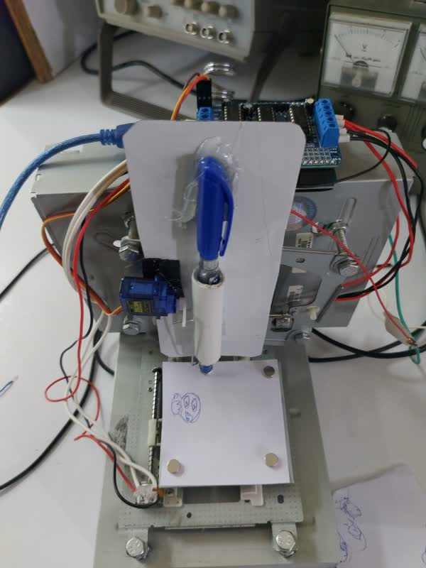

<html lang="fa" dir="rtl">
<head>
  <meta charset="UTF-8">
  <meta name="viewport" content="width=device-width, initial-scale=1">
  <title>پروژه کارشناسی - رضا احمدی</title>
  
</head>
<body>
  

    <h1>🎓 پروژه کارشناسی: سیستم مکانیکی با دو استپ موتور و یک سروو موتور</h1>
    
    

      این پروژه، پروژه کارشناسی من در رشته مهندسی برق گرایش الکترونیک دیجیتال در دانشگاه افرش است. در این پروژه یک سامانه مکانیکی طراحی و پیاده‌سازی شده است که با استفاده از <strong>دو موتور پله‌ای</strong> و <strong>یک سروو موتور</strong> کنترل می‌شود.
    

    <h2>🛠️ اجزای اصلی پروژه</h2>
    <ul>
      <li>دو عدد استپ موتور برای حرکت دقیق در دو محور</li>
      <li>یک سروو موتور برای اعمال حرکت زاویه‌ای</li>
      <li>برد آردوینو به عنوان کنترل‌کننده مرکزی</li>
      <li>درایور موتورها (A4988 یا ULN2003)</li>
      <li>منبع تغذیه مناسب برای موتورها</li>
    </ul>

    <h2>⚙️ عملکرد پروژه</h2>
    

      سیستم قادر است با استفاده از استپ موتورهای محور X و Y، موقعیت جسم مورد نظر را تغییر دهد و با کمک سروو موتور، عملیاتی مانند چرخش یا گرفتن را انجام دهد. کنترل کل سیستم توسط آردوینو انجام می‌شود.
    

    <h2>🖼️ تصاویر پروژه</h2>
    <h3>🔌 شماتیک مدار</h3>
    
    <h3>📦 تصویر نهایی پروژه مونتاژ شده</h3>
    

    

    <h2>📦 وابستگی‌ها</h2>
    <ul>
      <li>نرم‌افزار Arduino IDE</li>
      <li>کتابخانه <code>Servo.h</code></li>
      <li>درایورهای استپ موتور</li>
      <li>سیم‌کشی مطابق شماتیک</li>
    </ul>

    <h2>🧠 توسعه‌دهنده</h2>
    

      <strong>رضا احمدی</strong> 
      دانشجوی کارشناسی ارشد مهندسی برق – گرایش الکترونیک دیجیتال 
      دانشگاه افرش 
      GitHub: <a href="https://github.com/rezahmadi" target="_blank">rezahmadi</a>
    

    

      © 2025 رضا احمدی – تمامی حقوق محفوظ است.
    

  

</body>
</html>
