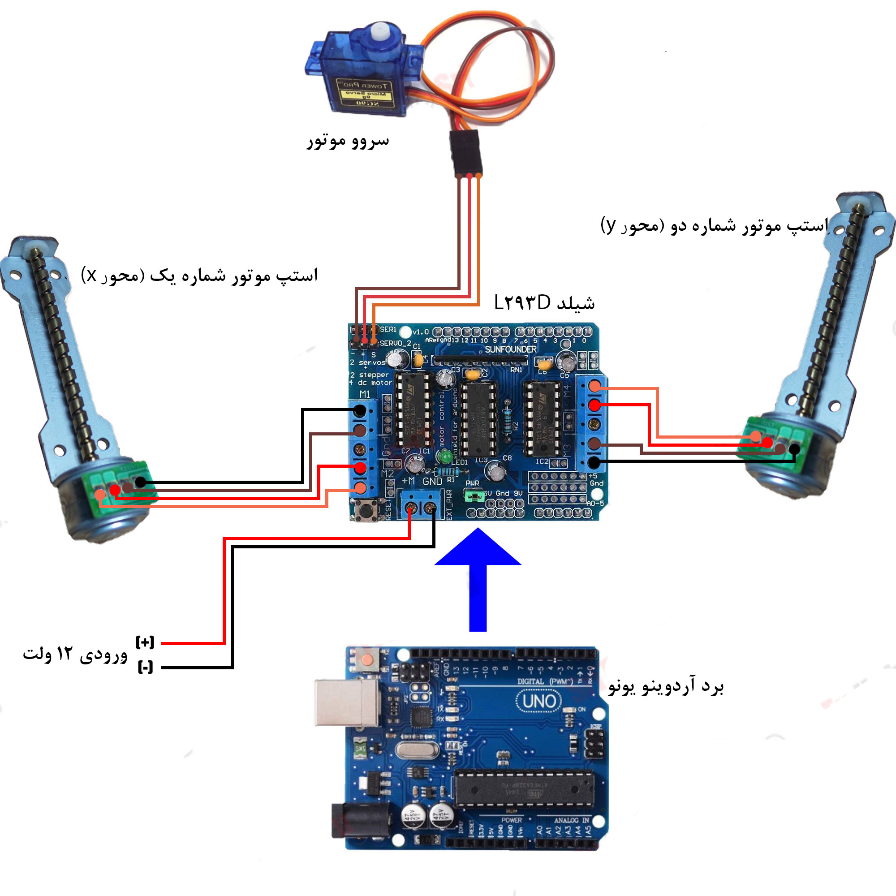

# 🎓 پروژه کارشناسی: سیستم مکانیکی کنترل‌شده با دو استپ موتور و یک سروو موتور

این پروژه، پروژه کارشناسی من در رشته مهندسی برق گرایش الکترونیک دیجیتال در دانشگاه افرش است. در این پروژه یک سامانه مکانیکی طراحی و پیاده‌سازی شده است که با استفاده از **دو موتور پله‌ای (Stepper Motor)** و **یک سروو موتور (Servo Motor)** کنترل می‌شود.

## 🛠️ اجزای اصلی پروژه

- دو عدد استپ موتور برای حرکت دقیق در دو محور
- یک سروو موتور برای اعمال حرکت زاویه‌ای
- برد آردوینو به عنوان کنترل‌کننده مرکزی
- درایور موتورها (مانند A4988 یا ULN2003)
- منبع تغذیه مناسب برای موتورهای استفاده شده
- طراحی و مونتاژ مدار با دقت بالا

## ⚙️ عملکرد پروژه

در این پروژه، سیستم طراحی شده قادر است با استفاده از استپ موتورهای محور X و Y، موقعیت جسم مورد نظر را تغییر دهد و با کمک سروو موتور، عملیاتی مانند چرخش یا گرفتن را انجام دهد. کل سیستم از طریق برنامه‌نویسی روی آردوینو کنترل می‌شود.

## 🖼️ تصاویر پروژه

### 🔌 شماتیک مدار

### 📦 تصویر نهایی پروژه مونتاژ شده

## 📁 ساختار فایل‌ها

